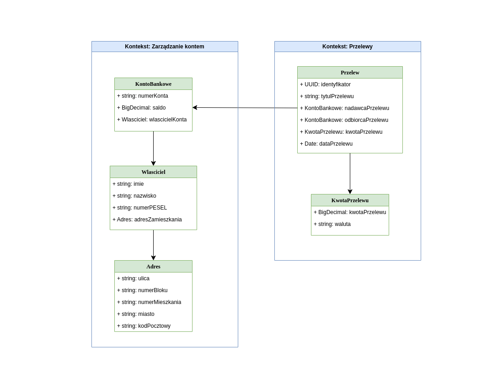

# ZADANIE 1 - DDD

W ramach zadania 1 należało zamodelować fragment aplikacji bankowej z wykorzystaniem zasad Domain Driven Design. Zdefiniowano dwa konteksty: 

### Kontekst: Zarządzanie kontem - zawiera operacje związane z zarządzaniem kontem bankowym.

Agregat: KontoBankowe  

Encje:  
- KontoBankowe  
- Wlasciciel  

Obiekty wartości:  
- Adres

### Kontekst: Przelewy - zawiera operacje związane z przelewami.

Agregat: Przelewy  

Encja:  
- Przelew  

Obiekty wartości:  
- KwotaPrzelewu  

## Przyjęte założenia:

- **KontoBankowe**. Pozwala zidentifykować nadawcę i odbiorcę w przypadku transakcji (przelewu).
  - numerKonta - składa się wyłącznie z cyfr. 
  - saldo - wartość liczbowa. 
   
- **Wlasciciel**. Zawiera informacje personalne o kliencie, posiadającego konto w banku.
  - imie, nazwisko - wyłącznie znaki alfabetyczne.
  - numerPESEL - string, dodatkowa walidacja, czy składa się z 11 znaków.
  
- **Adres**.
  - ulica, miasto - wyłącznie znaki alfabetyczne.
  - numerBloku, numerMieszkania - wyłącznie znaki alfanumeryczne.
  - kodPocztowy - wyłącznie cyfry, dodatkowa walidacja w formacie `\d{2}-\d{3}`.
  
- **Przelew**. Reprezentuje transakcję - przelew.
  - identyfikator - unikatowa wartość UUID.
  - tytułPrzelewu - wyłącznie znaki alfanumeryczne.
  - dataPrzelewu - wyłącznie cyfry, w formacie: `YYYY-MM-DD HH:mm:ss`

- **KwotaPrzelewu**.
    - kwotaPrzelewu - wartość liczbowa. Nie może być większa niż saldo środków na koncie nadawcy przelewu. Nie może być też wartością ujemną.
    - waluta - nazwa waluty, wyłącznie znaki alfabetyczne.

